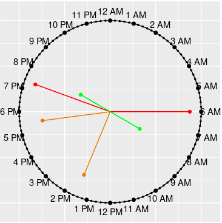

<!-- README.md is generated from README.Rmd. Please edit that file -->

```{r, include = FALSE}
knitr::opts_chunk$set(
  collapse = TRUE,
  comment = "#>",
  fig.path = "man/figures/README-",
  out.width = "100%"
)
```

# clockplot <a href=""></a>

<!-- badges: start -->
<!-- badges: end -->

The primary goal of clockplot is to plot event time on a clock chart. Additionally it 
helps you make a day chart, week chart, or month chart, or plan events in 
those periods.

## Installation

You can install the development version of clockplot from [GitHub](https://github.com/) with:

``` r
# install.packages("pak")
pak::pak("mahmudstat/clockplot")
```

## Usage

[Click here](https://mahmudstat.github.io/clockplot/reference/index.html) to 
see all the available functions. 

## Applications

Below we mention some relevant applications. [Click here](https://github.com/mahmudstat/clockplot/blob/main/README.Rmd) to 
see the reproducible codes. 

We have a small data of times of messages received throughout a particular
day, along with sender of the messages and their types. Let us the pattern
of messages by senders. 

```{r exqlt, echo=FALSE}
#| fig.alt = "SMS times"
library(clockplot)
clock_chart_qlt(smsclock, time = time, crit = sender)+
  ggplot2::scale_color_discrete(name = "Sender")+
  ggplot2::labs(title = "Times of Receiving SMS on a Particular Day")+
  ggplot2::theme(legend.position = "right")
```

### Modifying Clock Hands


```{r example, echo=FALSE}
#| fig.alt = "Clock chart of random event times based on a random sample."
set.seed(10)
df <- tibble::tibble(hr = sample(0:23, 50, replace = TRUE),
                  mnt = sample(0:59, 50, replace = TRUE),
                  sec = sample(0:59, 50, replace = TRUE),
                  time = paste(hr, mnt, sec, sep = ":"),
                  value = sample(60,50))
p1 <- clock_chart_qnt(df, time, crit = value)
p1 + ggplot2::theme(legend.position = "right")+
ggplot2::labs(title = "Times of Departure of Trains", 
              color = "Distance from Destination")
```

### Week Chart

```{r week-chart, echo=FALSE}
#| fig.alt = "Week chart of Temperature"
set.seed(15)
wtemp <- sample(10:40,7)
week_chart(wtemp, high = "yellow", lgnm = "Temperature")+
  ggplot2::labs(title = "Temperature Variation throughout the Week")
```


## Aditional Components

The charts produce `ggplot` objects, so you can make use of many of the
functions of the `ggplot2` package. You can use the `labs` function, for 
example, to add `title`, `subtitle`, `caption` etc. Some examples are shown
in the next segment.  

You can also add legend or change its position by using the code 
`theme(legend.position = "right")`; the accepted positions are `top`, 
`bottom`, `left`, and `right`.
