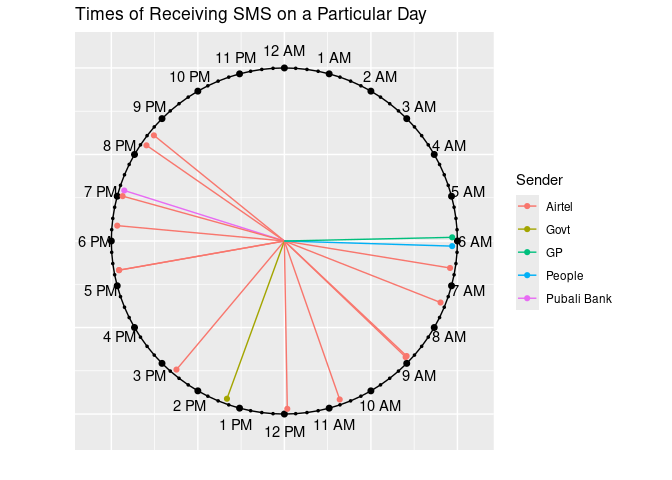
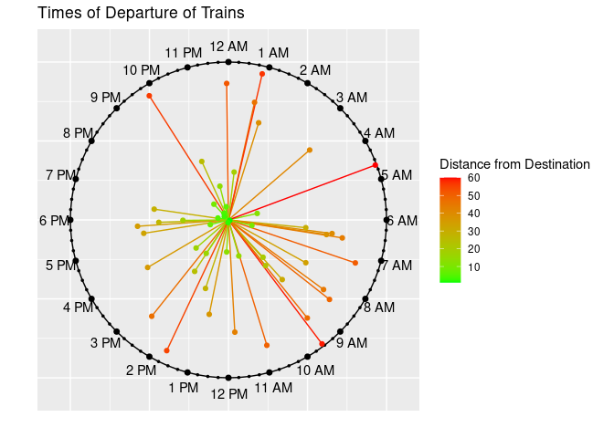
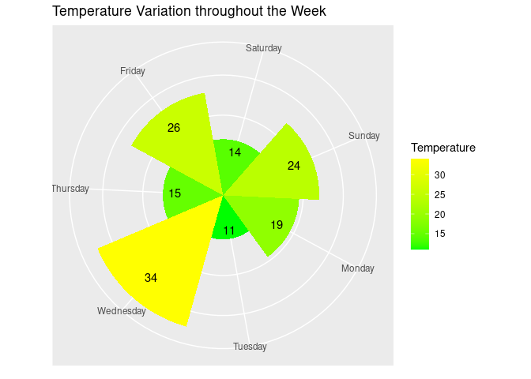

<!-- README.md is generated from README.Rmd. Please edit that file -->

# clockplot <a href=""></a>

<!-- badges: start -->
<!-- badges: end -->

The primary goal of clockplot is to plot event time on a clock chart.
Additionally it helps you make a day chart, week chart, or month chart,
or plan events in those periods.

## Installation

You can install the development version of clockplot from
[GitHub](https://github.com/) with:

``` r
# install.packages("pak")
pak::pak("mahmudstat/clockplot")
```

## Usage

[Click
here](https://mahmudstat.github.io/clockplot/reference/index.html) to
see all the available functions.

## Applications

Below we mention some relevant applications. [Click
here](https://mahmudstat.github.io/clockplot/articles/clockplot.html) to
see the reproducible codes.

We have a small data of times of messages received throughout a
particular day, along with sender of the messages and their types. Let
us the pattern of messages by senders.

    #> Warning in clock_chart_qlt(smsclock, time = time, crit = sender): No. of
    #> categories is more than 5 and may not be distinguished well. Try clock_chart()
    #> function instead?



### Modifying Clock Hands



### Week Chart



## Aditional Components

The charts produce `ggplot` objects, so you can make use of many of the
functions of the `ggplot2` package. You can use the `labs` function, for
example, to add `title`, `subtitle`, `caption` etc. Some examples are
shown in the next segment.

You can also add legend or change its position by using the code
`theme(legend.position = "right")`; the accepted positions are `top`,
`bottom`, `left`, and `right`.
