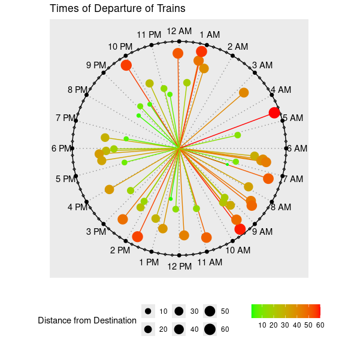

<!-- README.md is generated from README.Rmd. Please edit that file -->

# dataclock

<!-- badges: start -->
<!-- badges: end -->

The goal of dataclock is to plot event time on a clock chart.
Additionally it help you make a day chart, week chart, or month chart,
or plan events in those periods.

## Installation

You can install the development version of dataclock from
[GitHub](https://github.com/) with:

``` r
# install.packages("pak")
pak::pak("mahmudstat/dataclock")
```

## Usage

``` r
library(dataclock)

set.seed(10)
df <- tibble::tibble(hr = sample(0:23, 50, replace = TRUE),
                  mnt = sample(0:59, 50, replace = TRUE),
                  sec = sample(0:59, 50, replace = TRUE),
                  time = paste(hr, mnt, sec, sep = ":"),
                  value = sample(60,50))
p1 <- clock_chart_qnt(df, time, crit = value)
p1 + ggplot2::theme(legend.position = "right")+
ggplot2::labs(title = "Clock chart of random values")
#> Warning in ggplot2::geom_point(ggplot2::aes(0, 0), color = "black", size = 2): All aesthetics have length 1, but the data has 24 rows.
#> ℹ Please consider using `annotate()` or provide this layer with data containing
#>   a single row.
```


