# clockplot

The package `clockplot` is used to generate clock charts showing event
times on a 24-hour clock. Additionally it helps you make a day chart,
week chart, or month chart, or plan events in those periods.

The main focus is on the `clock_chart*()` functions. These allow you to
plot event times on a 24-hour clock.

## Getting started

After installing the package, load it to use the available functions.

``` r

library(clockplot)
```

## Types of Charts

The clockpolot offers three types of plot

1.  Clock charts
2.  Cyclic charts
3.  Period planner

The first type shows event times on a 24 hour clock. The times can be
arbitrary in the formats `HH:MM:SS`, `HH:MM` or even `H:M` (such as
`9:3`), and not necessarily specific hours at all.

The second type allows you to show values during a certain duration
(day, week, month, and year). There is a generic function
[`cyclic_chart()`](https://mahmudstat.github.io/clockplot/reference/cyclic_chart.md)
for arbitrary period, while there charts specially made for specific
period (day, week, year etc.)

Finally, the third one can help you make a plan in a certain period
(day, week, month, and year), presenting tasks against period.

## Clock Charts

Below is a summary of each `clock_chart*()` function use case.

| **function** | **Purpose** |
|:--:|----|
| [`clock_chart()`](https://mahmudstat.github.io/clockplot/reference/clock_chart.md) | To plot a basic clock chart, showing event times on clock, and to optionally choose a color for the hands |
| [`clock_chart_col()`](https://mahmudstat.github.io/clockplot/reference/clock_chart_col.md) | To color the plot by a quantitative variable, and optionally to change size of points by the same or another variable |
| [`clock_chart_qnt()`](https://mahmudstat.github.io/clockplot/reference/clock_chart_qnt.md) | To modify the length of the hands by a quantitative variable, along with all the options of [`clock_chart_col()`](https://mahmudstat.github.io/clockplot/reference/clock_chart_col.md) |
| `clock_chart_qlt` | To use a qualitative variable as the criteria |

Now Let’s see each in greater detail

The examples use built-in data sets. The allowed time formats for these
family of charts are `HH:MM:SS`, `HH:MM` or even `H:M` (such as
`12;30:09` or `9:3`).

### Basic Clock Chart

This is the simplest clock chart; the hands are neither colored nor
length modified by a criteria.

We are going to use the `smsclock` data set. Let us take a look on it.

``` r

head(smsclock)
#> # A tibble: 6 × 7
#>   Date       day       time     sender invoked type  Title     
#>   <chr>      <chr>     <chr>    <chr>  <chr>   <chr> <chr>     
#> 1 01-09-2024 Sunday    14:29:00 Airtel No      offer AirtelTune
#> 2 01-09-2024 Sunday    20:28:00 Airtel No      offer AirtelTune
#> 3 02-09-2024 Monday    10:43:00 Airtel No      offer AirtelTune
#> 4 03-09-2024 Tuesday   13:15:00 Airtel No      offer AirtelTune
#> 5 04-09-2024 Wednesday 12:24:00 Airtel No      offer AirtelTune
#> 6 04-09-2024 Wednesday 17:45:00 Airtel No      offer AirtelTune
```

The necessary code to produce a chart is simply the following:

``` r

clock_chart(smsclock, time, Col = "green")
```

The code produces a `ggplot2` object, so we can add (`+`) extra
components to make it more informative.

``` r

p1 <- clock_chart(smsclock, time, Col = "green")
p1 + ggplot2::labs(title = "SMS Receiving Times")
```

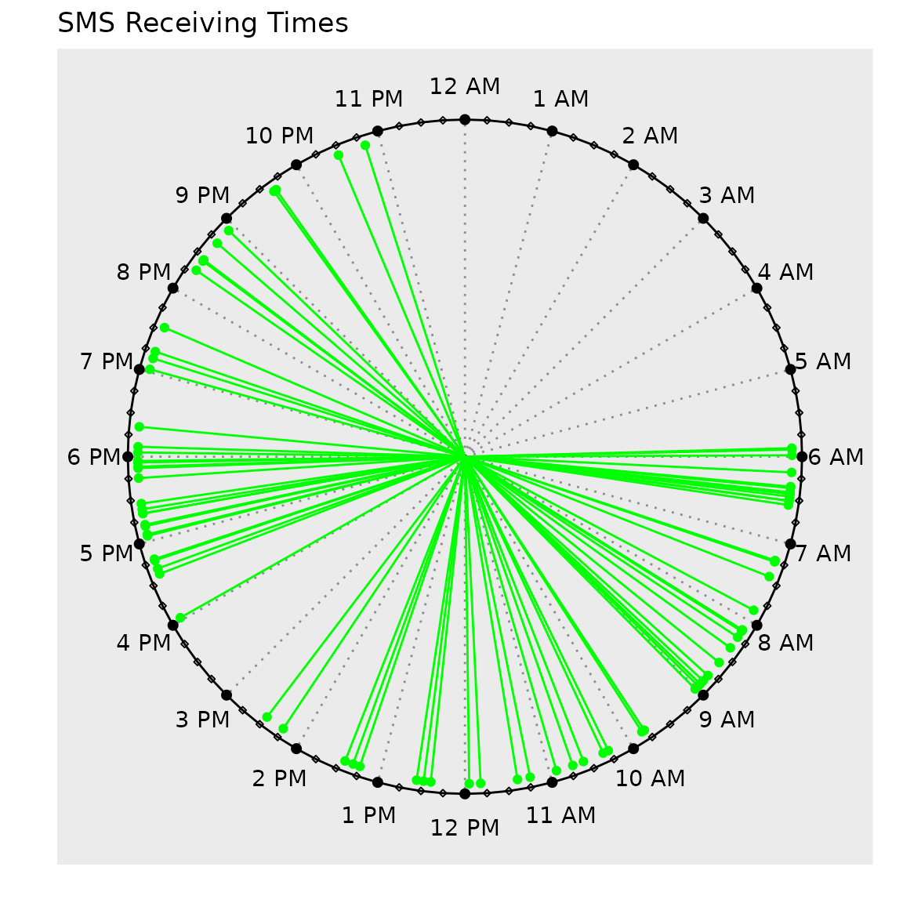

The chart shows when the messages are sent. The largest break is seen
during the night time (approximately 11 PM to 6 AM). Only one (01)
message is received from 2:30 PM to 4:30 PM. Other than a few
intermissions which are worth around 30 minutes, messages are received
round the clock.

### Colored Clock Chart

In the previous chart, we colored the hands by an arbitrary color. We
may want to color it by a `numeric` variable.
[`clock_chart_col()`](https://mahmudstat.github.io/clockplot/reference/clock_chart_col.md)
exactly does this.

We may use `bdquake` data set for this.

``` r

head(bdquake)
#>   latitude longitude  depth mag      hms
#> 1  24.3726   92.6936 35.000 4.4 21:12:27
#> 2  25.7318   91.0047 41.021 4.1 02:20:09
#> 3  21.9812   92.6510 44.892 4.1 16:46:37
#> 4  25.7414   90.2866 10.000 4.4 08:57:52
#> 5  25.2901   91.7860 46.386 4.2 03:16:57
#> 6  23.1475   90.9317 45.057 5.5 03:35:33
```

The code without added components.

``` r

clock_chart_col(bdquake, time = hms, crit = mag)
```

Let us modify it.

``` r

p <- clock_chart_col(bdquake, time = hms, crit = mag)
p + ggplot2::labs(size = "Magnitude", title = "Earthquakes in Bangladesh since 2023")
```

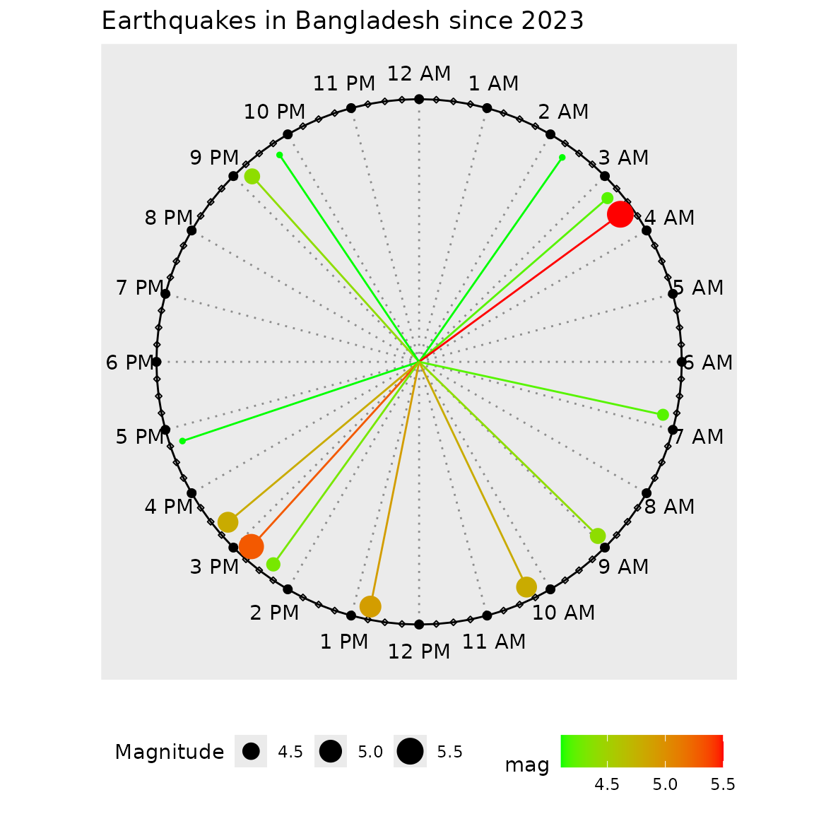

It would be great if we could modify the length of the hands as well. We
see that in the next chart.

### Chart with Modified and Colored Hands

We now use
[`clock_chart_qnt()`](https://mahmudstat.github.io/clockplot/reference/clock_chart_qnt.md).
We color the chart magnitude and change length by the depth of the
earthquake hypocenter.

``` r

clock_chart_qnt(
  data = bdquake, time = hms, len = depth,
  Col = mag, high = "red", low = "blue"
)
```

The `high` and `low` color names can be vice versa or other colors,
depending on the context. To use a single color for all lines, use same
value for `high` and `low`

**The custom plot**

``` r

p1 <- clock_chart_qnt(
  data = bdquake, time = hms, len = depth,
  Col = mag, high = "red", low = "blue"
)
p1 + ggplot2::labs(
  color = "Depth", size = "Magnitude",
  title = "Earthquakes in Bangladesh since 2023"
)
```

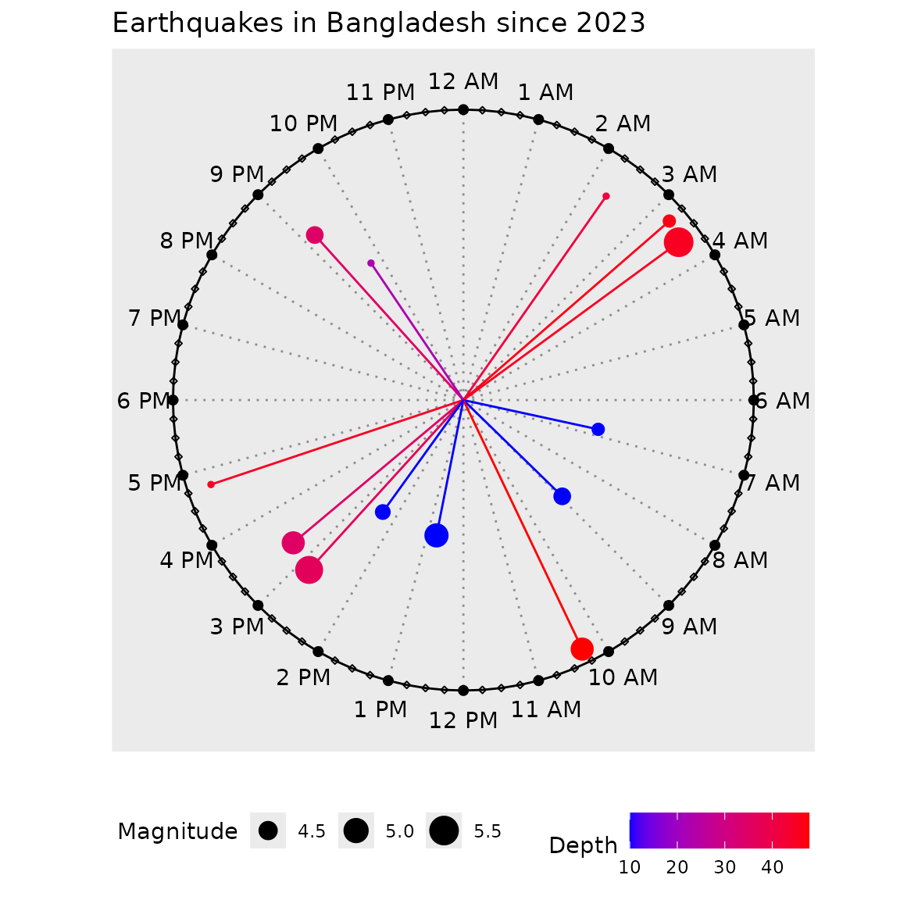

If you do not have two variables for `len` and `Col`, use one single
variable for both options.

As is evident from the chart, the size of the points represents the
magnitude of the earthquakes, while the color and the length of the
hands stand for depth of the earthquakes.

The plot shows that the quakes are roughly randomly distributed with
respect to time. Most earthquakes occurred between around 1 PM to around
5 PM. Two of the biggest gaps can be seen between 5 PM to 9 PM (a gap
amounting to 4 hours) and 10 PM to quarter after 2 AM (almost 4.25
hours).

If we want a single variable to determine color and length, we can use
the following method to properly show the legend. The plot code is shown
as a comment. To see the result, uncomment and run.

``` r

labs(size = "TITLE", color = "")
# clock_chart_qnt(acdt, time = Time, len = Temperature.F., Col = Temperature.F.)+labs(size = "Temperature", color = "")
```

#### US Accidents plot

The data is taken from
[Kaggle](https://www.kaggle.com/datasets/sobhanmoosavi/us-accidents) and
a small part (100 rows) extracted. To see the modified data, visit [this
link](https://raw.githubusercontent.com/mahmudstat/open-analysis/main/data/usacc.csv).

``` r

acdt <- read.csv("https://raw.githubusercontent.com/mahmudstat/open-analysis/main/data/usacc.csv")
clock_chart_qnt(acdt, time = Time, len = Humidity..., Col = Temperature.F.) +
  ggplot2::labs(size = "Humidity", color = "Temperature")
```

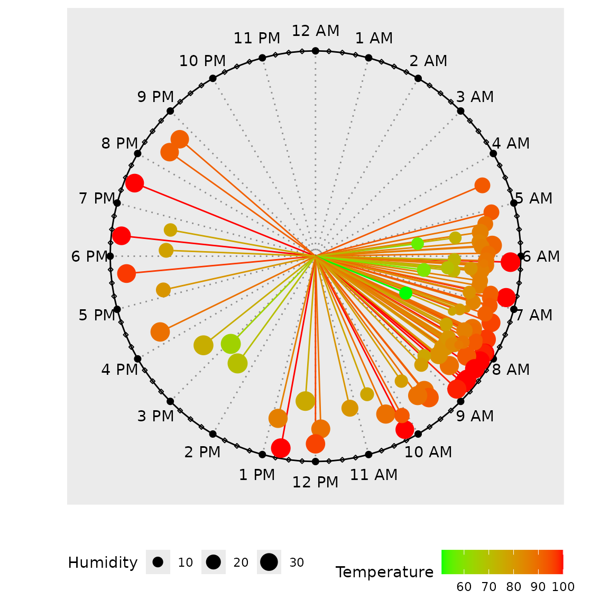

### Qualitative variable

Here we use the built-in `smsclock` data set.

``` r

head(smsclock, 4)
#> # A tibble: 4 × 7
#>   Date       day     time     sender invoked type  Title     
#>   <chr>      <chr>   <chr>    <chr>  <chr>   <chr> <chr>     
#> 1 01-09-2024 Sunday  14:29:00 Airtel No      offer AirtelTune
#> 2 01-09-2024 Sunday  20:28:00 Airtel No      offer AirtelTune
#> 3 02-09-2024 Monday  10:43:00 Airtel No      offer AirtelTune
#> 4 03-09-2024 Tuesday 13:15:00 Airtel No      offer AirtelTune
```

Now let us plot times with respect to message title.

``` r

clock_chart_qlt(smsclock, time = time, crit = Title) +
  ggplot2::labs(color = "Sender", title = "SMS's Received throughout the Day")
```

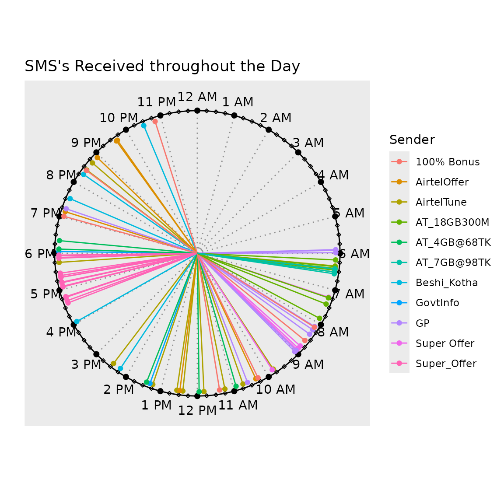

This makes it convenient to see which types of messages were sent when.
Certain types of messages, such as Supper_Offer, are always sent around
the same time (4:30 PM to 6 PM). Other messages are spread throughout
the day. Between 11 PM and 6 AM, no messages are received.

We can also make use of the
[`facet_wrap()`](https://ggplot2.tidyverse.org/reference/facet_wrap.html)
function from the `ggplot2` package.

We can use the following to see the visual relationship between message
Sender and the Day of the week.

``` r

clock_chart_qlt(smsclock, time = time, crit = sender) + facet_wrap(~day)
```

Or we may be interested to see the association between message title and
the time when they are sent.

``` r

clock_chart_qlt(smsclock, time = time, crit = sender) + facet_wrap(~Title)
```

**Instructions from the beginning which args to use in labs.**

## Other Charts

#### Cyclic Chart

``` r

Col <- c("#0040ff", "#00bfff", "#8000ff")
cyclic_chart(bdtemp,
  Period = Month, Value = Temperature,
  crit = City, ColV = Col
)
```

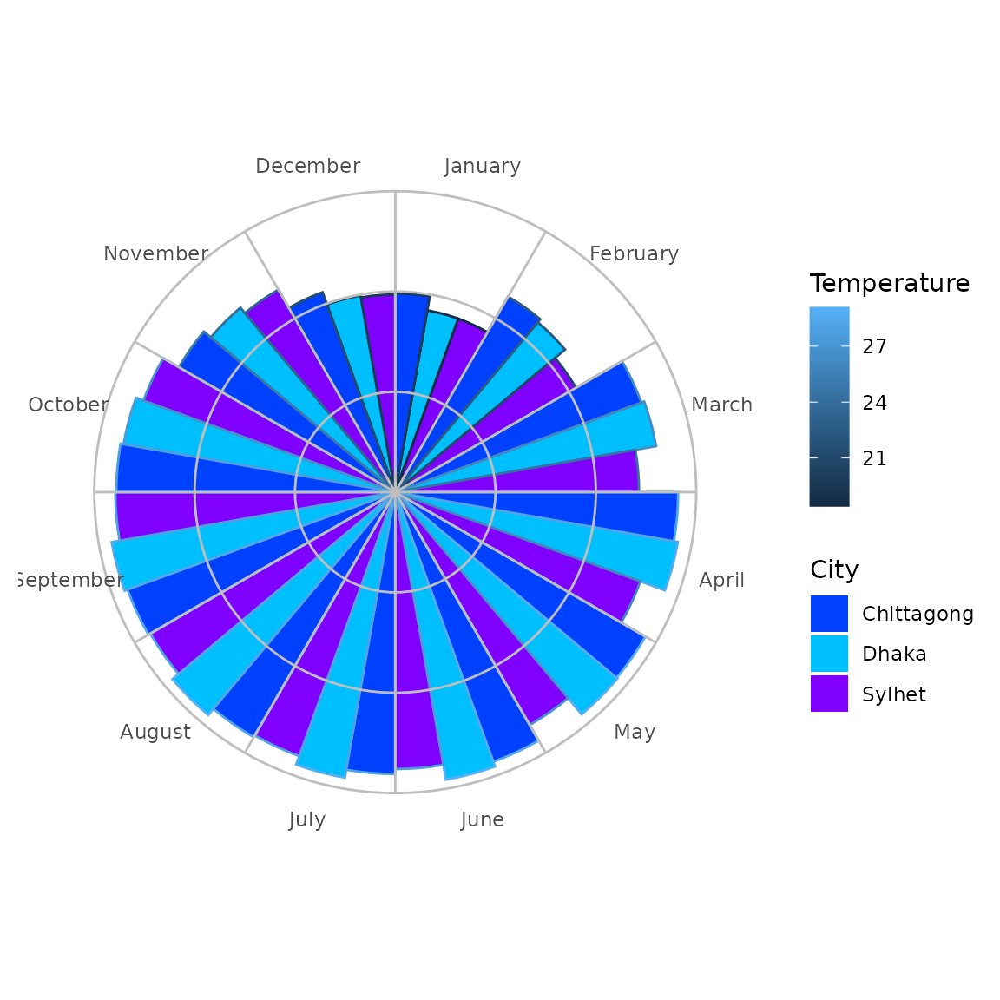

Or we can also make day or week charts.

``` r

value <- sample(15:30, 24, replace = TRUE)
day_chart(hvalue = value, high = "blue", low = "yellow", width = 0.8)
```

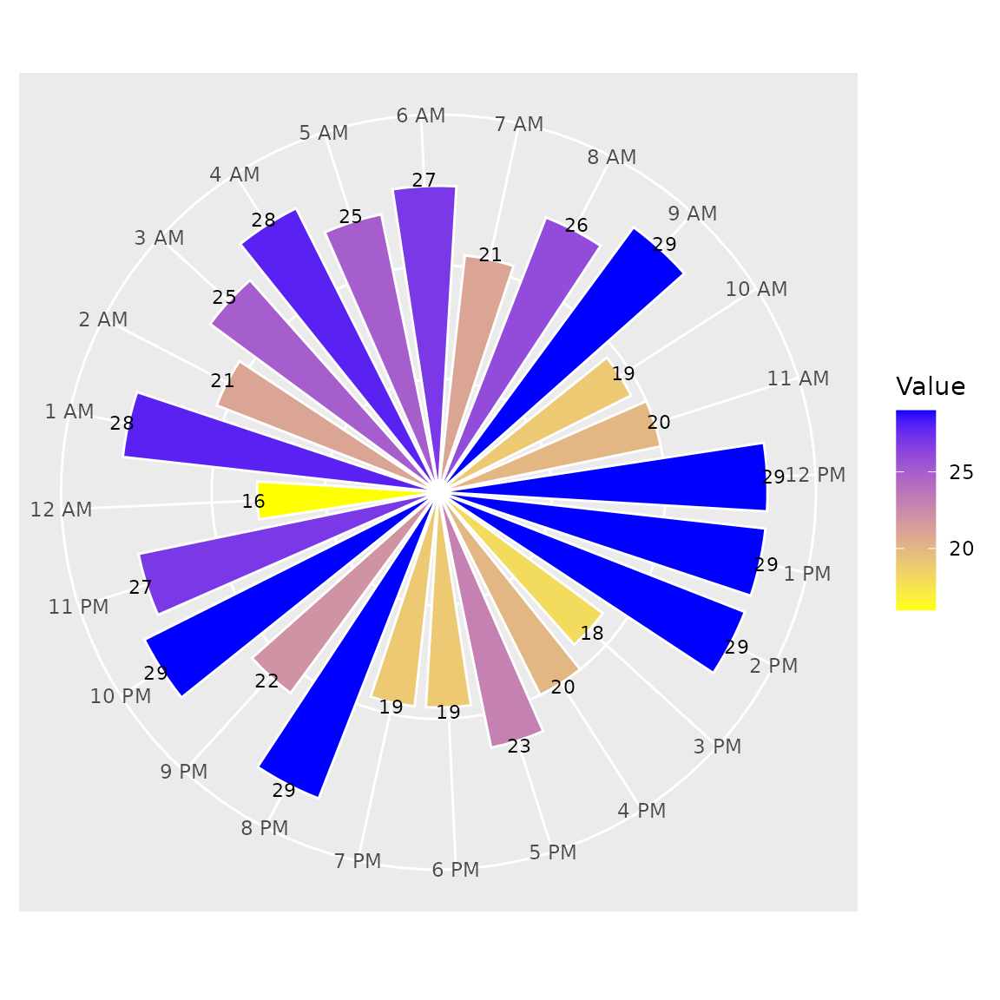

To see all the available functions, run
`getNamespaceExports("clockplot")` and then use `?function_name` to know
more about it and see and run examples. If you are connected to the
internet, [you may visit](https://github.com/mahmudstat/clockplot) the
repository and follow the website linked to see all the available
functions (`Reference` menu)

## Cyclic Charts

Cyclic charts use polar bar charts
([`coord_polar()`](https://ggplot2.tidyverse.org/reference/coord_radial.html))
to show values over repeating periods — hours of day, days of week,
months of year, or any custom cycle.

### `cyclic_chart()` — General Cyclic Chart

The most flexible cyclic chart. You provide the period variable, value
variable, a grouping factor, and colors.

``` r

Col <- c("#0040ff", "#00bfff", "#8000ff")
cyclic_chart(bdtemp,
  Period = Month, Value = Temperature,
  crit = City, ColV = Col
)
```

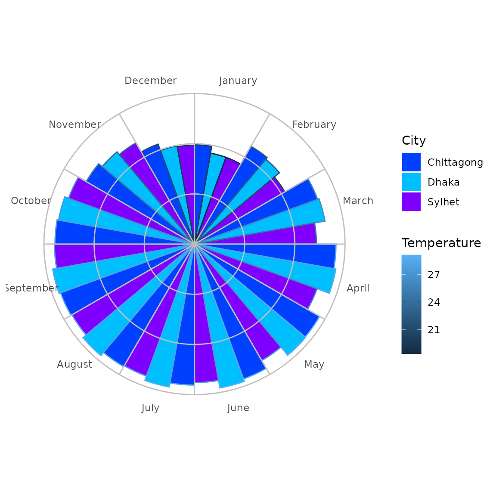

This shows monthly temperatures for three cities. Each city gets a
distinct color (`ColV`), and bar height represents temperature.

### `day_chart()` — 24-Hour Rose Plot

Plots a numeric value for each of 24 hours (starting at 6 AM). Uses a
gradient fill from `low` to `high`.

``` r

value <- sample(15:30, 24, replace = TRUE)
day_chart(hvalue = value, high = "blue", low = "yellow", width = 0.8)
```

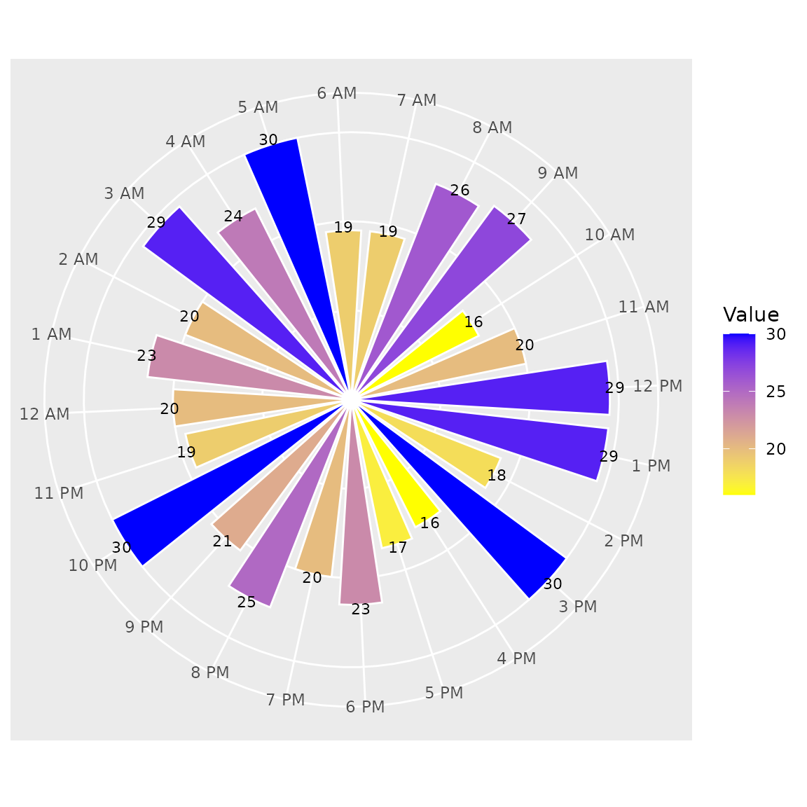

**Realistic example** — hourly temperature profile:

``` r

# Simulated hourly temperatures for a summer day (6 AM to 5 AM next day)
hourly_temp <- c(18, 17, 16, 16, 17, 19, 22, 25, 28, 30, 32, 33,
                 34, 34, 33, 32, 31, 29, 27, 24, 22, 21, 20, 19)
day_chart(hvalue = hourly_temp, high = "red", low = "lightblue", width = 0.9) +
  ggplot2::labs(title = "Hourly Temperature Profile", fill = "Temp (°C)")
```

### `week_chart()` — 7-Day Rose Plot

Plots values for each day of the week (starting Saturday).

``` r

set.seed(10)
wtemp <- sample(10:40, 7)
week_chart(wtemp, high = "yellow") + ggplot2::labs(title = "Random Values by Day")
```

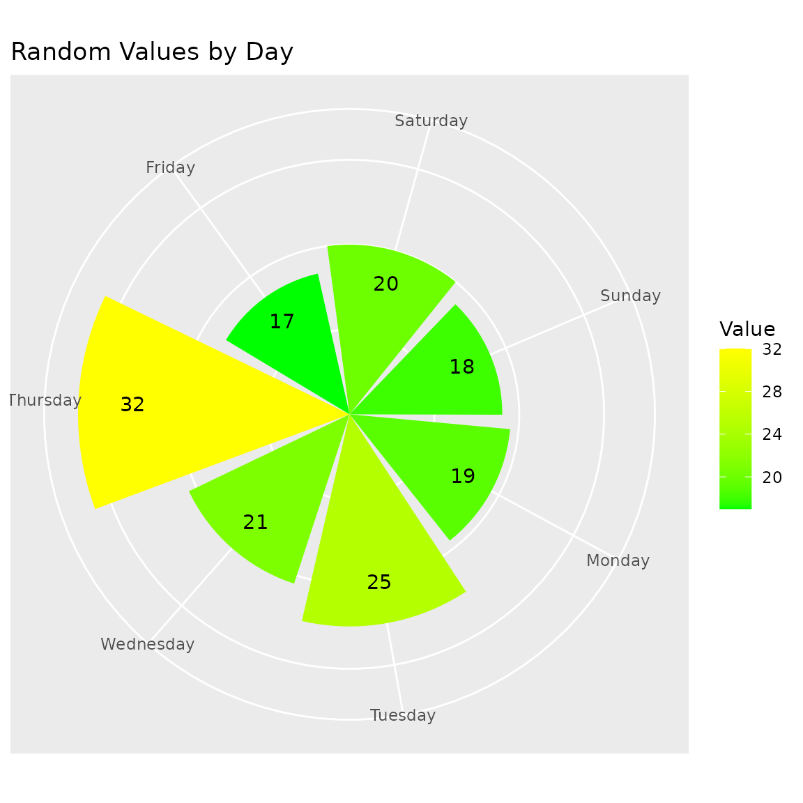

**Realistic example** — weekly website traffic:

``` r

weekly_visits <- c(1200, 950, 2100, 2300, 2400, 2200, 1500)  # Sat–Fri
week_chart(weekly_visits, lgnm = "Visits", high = "darkblue", low = "lightblue") +
  ggplot2::labs(title = "Weekly Website Traffic")
```

### `year_chart()` — 12-Month Rose Plot

Plots values for each month (January–December).

``` r

syltmp <- c(18.4, 20.8, 24.3, 26.0, 26.8, 27.6, 28.0,
            28.2, 27.9, 26.7, 23.3, 19.7)
year_chart(mvalue = syltmp)
```

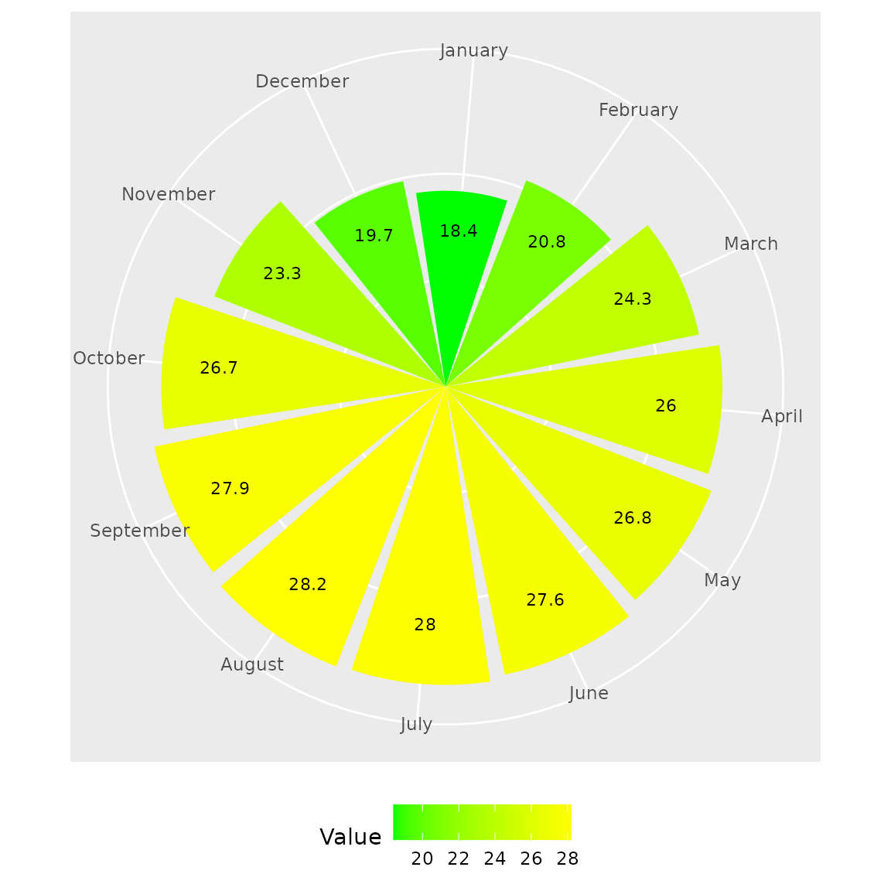

**Realistic example** — monthly rainfall:

``` r

monthly_rain <- c(12, 10, 15, 45, 120, 280, 320, 290, 210, 85, 30, 15)  # mm
year_chart(mvalue = monthly_rain, lgnm = "Rainfall (mm)", high = "darkblue", low = "lightcyan") +
  ggplot2::labs(title = "Monthly Rainfall in Dhaka")
```

## Period Planners

These functions help you visually plan activities across a day or week.

### `plan_day()` — Daily Activity Planner

Takes a character vector of 24 activities (one per hour, starting 6 AM)
and creates a polar schedule.

``` r

set.seed(123)
work <- sample(c("Study", "Adda", "Entertainment", "Games", "Exercise", "Meal"),
  size = 24, replace = TRUE
)
plan_day(dwork = work, brdcol = NA)
```

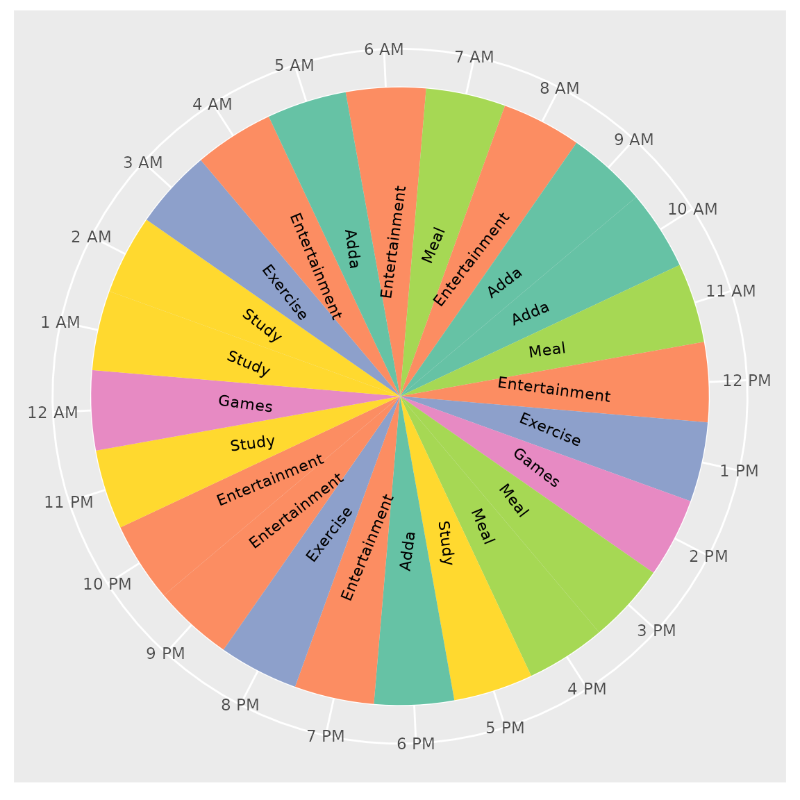

**Realistic example** — a student’s schedule:

``` r

my_day <- c(
  "Sleep", "Sleep", "Sleep", "Sleep", "Sleep", "Wake/Breakfast",  # 6-11 AM
  "Class", "Class", "Lunch", "Class", "Class", "Study",          # 12-5 PM
  "Exercise", "Dinner", "Study", "Free", "Free", "Relax",        # 6-11 PM
  "Sleep", "Sleep", "Sleep", "Sleep", "Sleep", "Sleep"           # 12-5 AM
)
plan_day(dwork = my_day, width = 0.95, brdcol = "white") +
  ggplot2::labs(title = "My Daily Schedule")
```

### `plan_week()` — Weekly Activity Planner

Takes a factor/character vector of 7 activities (Saturday–Friday).

``` r

set.seed(10)
wtask <- c(
  "Desk Work", "Field Work", "Visit", "Monitoring",
  "Rest", "Reporting", "Meeting"
)
plan_week(wtask)
```

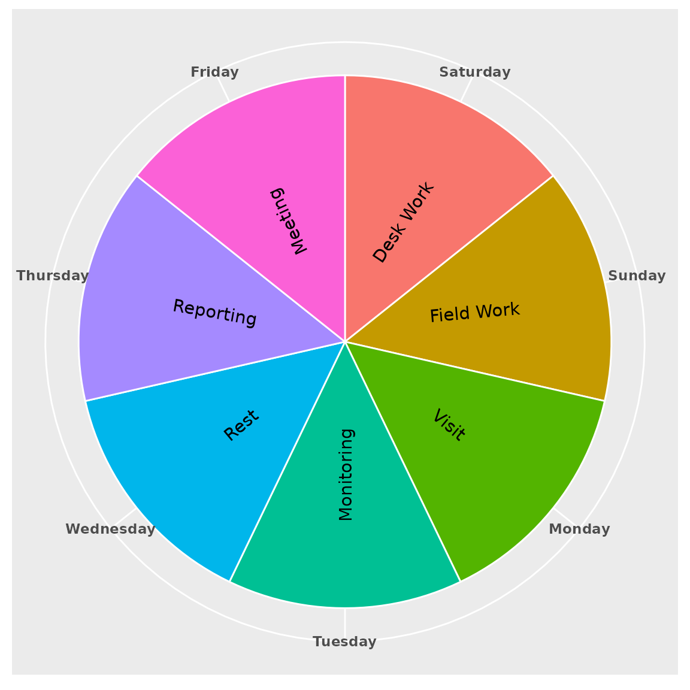

**Realistic example** — work week plan:

``` r

work_week <- c(
  "Deep Work", "Meetings", "Client Calls", "Analysis",
  "Writing", "Admin", "Planning"
)
plan_week(work_week) + ggplot2::labs(title = "Weekly Work Plan")
```

## Complete Case Study: US Accidents Analysis

This example demonstrates a full workflow: data import → cleaning →
visualization → interpretation.

``` r

library(tidyverse)
library(clockplot)

# 1. Import data (100-row sample from Kaggle US Accidents dataset)
acdt <- read.csv("https://raw.githubusercontent.com/mahmudstat/open-analysis/main/data/usacc.csv")

# 2. Inspect
glimpse(acdt)
#> Rows: 100
#> Cols: 4: Time, Temperature.F., Humidity..., Severity

# 3. Basic clock chart — when do accidents happen?
clock_chart(acdt, Time, Col = "darkred") +
  labs(title = "US Accidents: Time of Day")

# 4. Multivariate: color by temperature, size by humidity
clock_chart_qnt(acdt, time = Time, len = Humidity..., Col = Temperature.F.) +
  labs(size = "Humidity (%)", color = "Temperature (°F)",
       title = "US Accidents: Time, Temperature & Humidity")

# 5. Facet by severity to compare patterns
clock_chart_qlt(acdt, time = Time, crit = Severity) +
  facet_wrap(~Severity) +
  labs(color = "Severity", title = "Accidents by Severity Level")

# 6. Cyclic view: average humidity by hour of day
acdt %>%
  mutate(hour = as.numeric(substr(Time, 1, 2))) %>%
  group_by(hour) %>%
  summarise(avg_humidity = mean(Humidity...), .groups = "drop") %>%
  mutate(hour_label = factor(hour, levels = 0:23)) %>%
  day_chart(hvalue = .$avg_humidity, high = "blue", low = "yellow") +
  labs(title = "Average Humidity by Hour", fill = "Humidity (%)")
```

**Interpretation**: - **Peak hours**: Accidents cluster around morning
rush (6–9 AM) and evening (4–7 PM) - **Weather correlation**: Higher
humidity (larger points) correlates with evening accidents -
**Severity**: Level 3–4 accidents (more severe) appear more frequent at
night - **Cyclic pattern**: Humidity peaks overnight (natural diurnal
cycle), contributing to reduced visibility

## Parameter Reference Table

All exported functions and their key arguments:

| Function | Data Arg | Time/Period Arg | Value/Metric Args | Color Args | Other Key Args |
|----|----|----|----|----|----|
| [`clock_chart()`](https://mahmudstat.github.io/clockplot/reference/clock_chart.md) | `data` | `time` | — | `Col` (single color) | — |
| [`clock_chart_col()`](https://mahmudstat.github.io/clockplot/reference/clock_chart_col.md) | `data` | `time` | `crit` (numeric) | `high`, `low` (gradient) | — |
| [`clock_chart_qnt()`](https://mahmudstat.github.io/clockplot/reference/clock_chart_qnt.md) | `data` | `time` | `len` (numeric), `Col` (optional numeric) | `high`, `low` (gradient) | — |
| [`clock_chart_qlt()`](https://mahmudstat.github.io/clockplot/reference/clock_chart_qlt.md) | `data` | `time` | `crit` (factor/character) | Auto (brewer Set2) | Warns if \>5 categories |
| [`cyclic_chart()`](https://mahmudstat.github.io/clockplot/reference/cyclic_chart.md) | `df` | `Period` | `Value` (numeric) | `ColV` (color vector), `crit` (factor) | — |
| [`day_chart()`](https://mahmudstat.github.io/clockplot/reference/day_chart.md) | — | — (implicit 24h) | `hvalue` (numeric, len=24) | `high`, `low` (gradient) | `width` |
| [`week_chart()`](https://mahmudstat.github.io/clockplot/reference/week_chart.md) | — | — (implicit 7d) | `wvalue` (numeric, len=7) | `high`, `low` (gradient) | `lgnm`, `width` |
| [`year_chart()`](https://mahmudstat.github.io/clockplot/reference/year_chart.md) | — | — (implicit 12m) | `mvalue` (numeric, len=12) | `high`, `low` (gradient) | `lgnm`, `width` |
| [`plan_day()`](https://mahmudstat.github.io/clockplot/reference/plan_day.md) | — | — (implicit 24h) | `dwork` (character, len=24) | Auto (brewer Set2) | `width`, `brdcol` |
| [`plan_week()`](https://mahmudstat.github.io/clockplot/reference/plan_week.md) | — | — (implicit 7d) | `wtask` (character/factor, len=7) | Auto (fill = day) | — |

All functions return a `ggplot` object — pipe to `+ labs()`,
`+ theme()`, `+ facet_wrap()`, etc.
