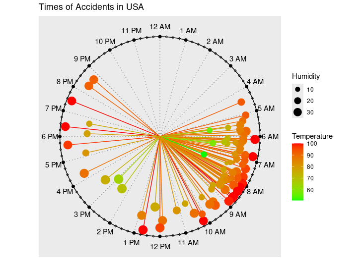
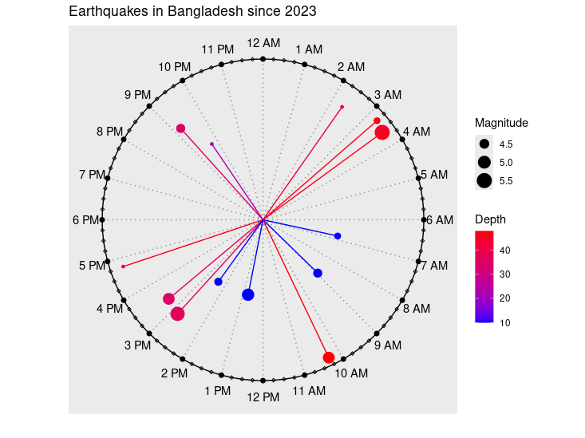

# Summary

Visualization is a fundamental component of statistical analysis and
prediction, enabling clear data description and informed model
selection. While various methods exist for visualizing event data, there
is a notable gap in representing events on a clock face. In this paper,
we introduce clockplot, an R package for plotting timestamped events on
a 24-hour circular clock face. This approach offers a powerful way to
perceive the precise timing of events and facilitates intuitive
comparisons with other events. The clockplot is particularly useful for
analyzing daily patterns, event clustering, and temporal gaps. For event
times, it is significantly more revealing than conventional
visualizations like bar or pie charts. This package also generalizes the
clockplot approach to create cyclic charts for other time frames,
including weekly and monthly cycles. This functionality enables
effective event planning and pattern analysis across multiple periods,
providing a new and insightful tool for temporal data analysis.

# Statement of Need

Visualizing temporal patterns in timestamped event data presents unique
challenges, particularly when events exhibit cyclical behavior over
24-hour periods. Traditional linear timelines (e.g., using
[`ggplot2::geom_point()`](https://ggplot2.tidyverse.org/reference/geom_point.html)
with time on the x-axis) have several limitations for this type of
analysis:

1.  **Circular continuity is broken**: The natural continuity between
    23:59 and 00:00 is not preserved, making it difficult to see
    patterns that span midnight.
2.  **Density patterns are hard to discern**: Clustering of events
    around specific times of day is less visually apparent on linear
    axes.
3.  **Multiple days of data become cluttered**: Plotting several days of
    data on a linear timeline creates overlapping points that obscure
    daily patterns.

# Available Software

While several R and Python packages offer circular or radial
visualization capabilities, they are either too general-purpose or not
specifically designed for timestamp data:

- **General circular plotting**: Packages like `circular` and `plotrix`
  provide basic circular plotting \[@R-plotrix; @R-circular\] but
  require extensive data transformation for timestamp visualization.
- **Polar coordinates**: `ggplot2` with `coord_polar()` can create
  circular plots, but requires manual conversion of timestamps to
  radians and lacks specialized aesthetics for event data \[@ggplot2\].
- **Specialized but limited**: Packages like `chron` and `lubridate`
  handle time data but don’t provide circular visualization methods
  \[@lubridate\].
- **CircadiPy**: deals with rhythmic data, but does not create circular
  visualizations \[@carvalho2024circadipy\].

The package provides specialized visualization methods for multivariate
data including **colored point aesthetics** (mapping variables to
hue/size/shape) and **modifiable clock hand lengths** (representing
magnitude or intensity at each timestamp). These features enable clear
differentiation of multiple variables on the same 24-hour clock face
while maintaining intuitive interpretation of temporal patterns.

# Acceptable Data Type

clockplot handles two primary data types:

## 1. Timestamped Event Data

For analyzing patterns in event occurrences, such as website visits,
system logs, or biological rhythms:

| ID  | Time     | ID  | Time     |
|-----|----------|-----|----------|
| 1   | 21:12:27 | 5   | 03:16:57 |
| 2   | 02:20:09 | 6   | 03:35:33 |
| 3   | 16:46:37 | 7   | 21:44:36 |
| 4   | 08:57:52 | 8   | 12:45:15 |

## 2. Multivariate Time Series Data

For visualizing continuous measurements at specific times, such as
environmental monitoring or physiological data:

| Time     | Temperature | Time     | Temperature |
|----------|-------------|----------|-------------|
| 21:12:27 | 20.1°C      | 03:16:57 | 21.4°C      |
| 02:20:09 | 20.2°C      | 03:35:33 | 20.6°C      |

# Features

The following code creates a circular visualization of USA accidents:

``` r
library(tidyverse)
library(clockplot)
acdt <- read.csv("https://raw.githubusercontent.com/mahmudstat/open-analysis/main/data/usacc.csv")
acdt %>% ggplot(aes(Time, Humidity...))+
  geom_bar(stat = "identity")+
  labs(x = "Time",
       y = "Humidity",
       title = "USA Accidents Time and Corresponding Humidity")
```



USA Accidents Time and Corresponding Humidity

Figure 1 reveals several important patterns:

1.  **Clear temporal clustering**: Accidents peak during evening rush
    hours (5-7 PM) and show a secondary morning peak (8-9 AM)
2.  **Critical gaps**: Noticeably fewer accidents occur between 2-5 AM
3.  **Multivariate encoding**: Each point encodes two additional
    variables:
    - **Point size** represents humidity levels
    - **Point color** represents temperature (red = warmer, blue =
      cooler)
4.  **Cross-midnight continuity**: The natural connection between
    late-night (11 PM) and early-morning (1-2 AM) accidents is preserved

The plot enables immediate identification of high-risk periods while
simultaneously showing how environmental factors correlate with accident
frequency—a multidimensional insight difficult to achieve with
traditional linear timelines.

Similar conclusions can be drawn from Figure 2.



Recent Earthquakes in Bngladesh

Figure 3 plots qualitative data, showing not only when SMS messages were
received but also who sent them.


Timestamps of Incoming SMS and Senders

# Usage

Complete documentation with all parameters and examples is available at
[mahmudstat.github.io/clockplot](https://mahmudstat.github.io/clockplot).

# Citations

# Acknowledgments

The example analyses use data from public repositories including the US
Accidents Dataset and earthquake data from the United States Geological
Survey (USGS).

We are grateful to the Comprehensive R Archive Network (CRAN)
\[@R-base\] team for maintaining the infrastructure that supports open
source software distribution and reproducibility in R. We also
acknowledge GitHub for providing the collaborative platform used to
develop, maintain, and share the source code for this package.

# **Conflict of Interest**

The authors declare that they have no conflicts of interest related to
this work.

# References
